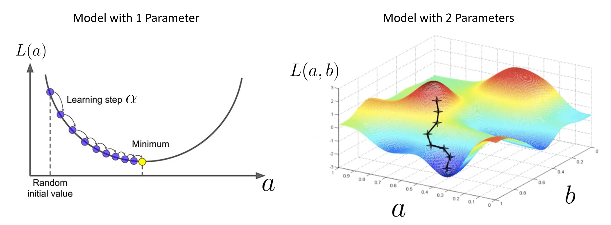
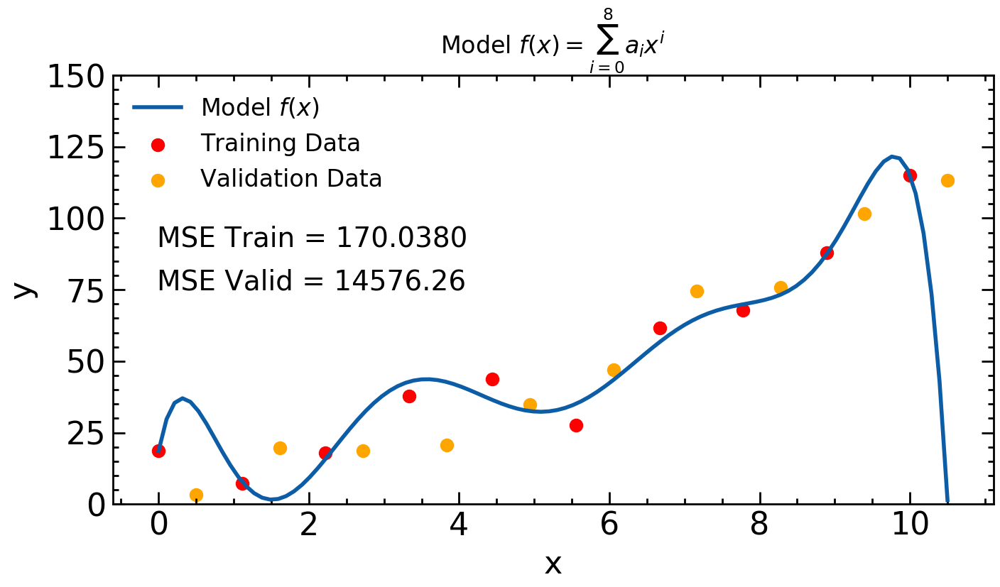

 
 In this section we will establish the mathematical foundations of machine learning. We will define three important quantities: **data**, **models**, and **loss functions**. We will then discuss the optimization procedure known as **gradient descent**.
 
# Definitions
 
 Some common definitions are included below.
 
  * **Data** $$(x_i, y_i)$$ where $$i$$ represents the $$i^{\text{th}}$$ data point. The $$x_i$$ are typically referred to as **instances** and the $$y_i$$ as **labels**. In general the $$x_i$$ and $$y_i$$ don't need to be numbers. For example, in a dataset consisting of pictures of animals, the $$x_i$$ might be images (consisting of height, width, and color channel) and the $$y_i$$ might be a string which states the type of animal.  
  
* **Model**: Some abstract function $$f$$ such that $$y=f(x;\theta)$$ is used to model the individual $$(x_i, y_i)$$ pairs. $$\theta$$ is used to represent all necessary parameters in the function, so it can be thought of as a vector. For example, if the $$(x_i, y_i)$$ are real numbers and approximately related through a quadratic function, then an adequate model might be $$f(x;a,b,c)=ax^2+bx+c$$. Note that one could also use the model $$f(x;a,b,c,...)=ax^3+b\sin(x)+ce^x + ...$$ to model the dataset; a model is just *some* function; it doesn't need to model the data well necessarily. For the case where the $$x_i$$ are pictures of animals and the $$y_i$$ are strings of animal names, the function $$f$$ may need to be quite complex to achieve reasonable accuracy. 

* **Loss Function**: A function that determines *how well the model $$y=f(x)$$ predicts the data $$(x_i, y_i)$$*. Some models work better than others. One such loss function might be $$\sum_i (y_i-f(x_i))^2$$: the mean-squared error. For the quadratic function this would be $$\sum_i (y_i-(ax_i^2+bx_i+c))^2$$. One doesn't need to use the mean-squared error (MSE) as a loss function, however; one could also use the mean-absolute error (MAE), or the mean-cubed error, etc. What about cases where the $$x_i$$ represent pictures of animals and the $$y_i$$ are strings representing the animal in the picture? How can we define a loss function to account for the *error* the function made when classifying this picture? In this case one needs to be clever about loss functions as functions like the MSE or MAE don't make sense anymore. A common loss function in this case is the *cross entropy loss function*.

> ## Loss Function and Likelihood
> The MSE loss function is a special case of using the maximum log-likelihood method when the model $$f$$ describes measurements as outcomes of independent Gaussian random variables where each random variable has the same standard deviation. In this case $$\ln L(\theta) = \text{const.} - \frac{1}{2\sigma^2} \sum_{i=1}^N (y_i-f(x_i, \theta))^2$$ where $$L$$ is the likelihood function, $$(x_i, y_i)$$ are the data, $$\sigma$$ is the standard deviation of the random variables, and $$\theta$$ represents the model parameters. Since we subtract the loss function in the formula for log-likelihood, minimizing the MSE loss function is equivalent to maximizing the likelihood.
{: .callout}

{:width="80%"}

What's important to note is that once the data and model are specified, then the loss function depends on the parameters of the model. For example, consider the data points $$(x_i, y_i)$$ in the plot above and the MSE loss function.  For the left hand plot the model is $$y=ax^2+bx+c$$ and so the MSE depends on $$a$$, $$b$$, and $$c$$ and $$L=L(\theta)=L(a,b,c)$$. For the right hand plot, however, the model is $$y=ae^{bx}$$ and so in this case the MSE only depends on two parameters: $$a$$ and $$b$$ and $$L(\theta)=L(a,b)$$.

# Gradient Descent

For most applications, the goal of machine learning is to optimize a loss function with respect to the parameters of a model given a dataset and a model. Lets suppose we have the dataset $$(x_i, y_i)$$, the model $$y=ax^2+bx+c$$, and we use the loss function $$L(\theta) = L(a, b, c) = \sum_i (y_i-(ax_i^2+bx_i+c))^2$$ to determine the validity of the model. We want to minimize the loss function with respect to $$a$$, $$b$$, and $$c$$ (thus creating the best model). One such way to do this is to pick some random initial values for $$a$$, $$b$$, and $$c$$, and then repeat the following two steps until we reach a minimum for $$L(a,b,c)$$

1. Evaluate the gradient $$\nabla_{\theta} L$$. The negative gradients points to where the function $$L(\theta)$$ is decreasing.

2. Update $$\theta \to \theta - \alpha \nabla_{\theta} L$$ The parameter $$\alpha$$ is known as the **learning rate** in machine learning.

This procedure is known as **gradient descent** in machine learning. It's sort of like being on a mountain, and only looking at your feet to try and reach the bottom. You'll likely move in the direction where the slope is decreasing the fastest. The problem with this technique is that it may lead you into local minima (places where the mountain has "pits" but you're not at the base of the mountain).

{:width="80%"}

Note that the models in the plots above have 1 (left) and 2 (right) parameters. A typical neural network can have $$O(10^4)$$ parameters. In such a situation, the gradient is a vector with dimensions $$O(10^4)$$; this can be computationally expensive to compute. In addition, the gradient $$\nabla_{\theta} L$$ depends on *all the data points* $$(x_i, y_i)$$. This is often computationally expensive for datasets that include many data points. Typical machine learning data sets can have millions of (multi-dimesional) data points. A solution to this is to sample a different small subset of points each time the gradient is computed. This is known as **batch gradient descent**.  

# The Fly in the Ointment: Overfitting

{:width="80%"}

In general, a model with more parameters can fit a more complicated dataset. Consider the plot above

* The red and orange data points are both taken from the same population
* The model is only trained on the red data points
* The mean squared error is much lower for the points to which the model was exposed.

This phenomenon is known as overfitting in machine learning. In general you want to train the model on some known data points $$(x_i,y_i)$$ and then use the model to make predictions on new data points, but if the model is overfitting then the predictions for the new data points will be inaccurate.

The main way to avoid this phenomenon in machine learning is by using what is known as a **training** set $$(x_i, y_i)_t$$ and a **validation** set $$(x_i, y_i)_v$$. The training set typically consists of 60%-80% of your data and the validation set consists of the rest of the data. During training, one only uses the the training set to tune $$\theta$$. One can then determine if the model is overfitting by comparing $$L(\theta)$$ for the training set and the validation set. Typically, the model will start to overfit after a certain number of gradient descent steps: a straightforward way to stop overfitting is to stop adjusting $$\theta$$ using gradient descent when the loss function starts to significantly differ between training and validation.

# Regression, Classification, Generation

The three main tasks of machine learning can now be revisited with the mathematical formulation.

1. **Regression**. The data in this case are $$(x_i, y_i)$$, where the $$y_i$$ are in $$\mathbb{R}^n$$. For example, each instance $$x_i$$ might specify the height and weight of a person and $$y_i$$ the corresponding resting heart rate of the person. A common loss function for this type of problem is the MSE.

2. **Classification**. The data in this case are $$(x_i, y_i)$$, where $$y_i$$ are discrete values that represent classes. For example, each instance $$x_i$$ might specify the petal width and height of a flower and each $$y_i$$ would then specify the corresponding type of flower. A common loss function for this type of problem is cross entropy. In these learning tasks, a machine learning model typically predicts the *probability* that a given $$x_i$$ corresponds to a certain class. Hence if the possible classes in the problem are $$(C_1, C_2, C_3, C_4)$$ then the model would output an array $$(p_1, p_2, p_3, p_4)$$ where $$\sum_i p_i = 1$$ for each $$y_i$$.

3. **Generation**. As discussed previously, the input is a random distribution (typically Gaussian noise) and the output is some data: typically an image. You can think of the input as *codings* of the image to be generated. This process is fundamentally different than regression or classification. For more information see [Wikipedia](https://en.wikipedia.org/wiki/Generative_adversarial_network) for an introduction or if you have it available, [Chapter 17](https://www.oreilly.com/library/view/hands-on-machine-learning/9781492032632/) where Generative Adversarial Networks are discussed.


