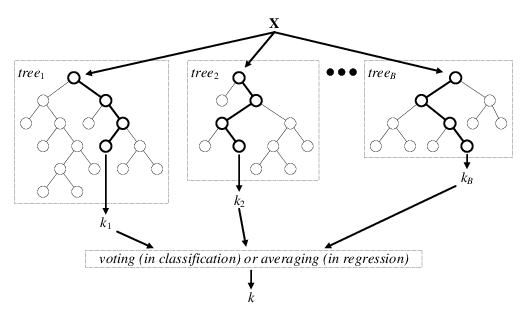

# Models

In this section we will examine 2 different machine learning models $$f$$ for classification: the random forest (RF) and the fully connected neural network (NN).

## Random Forest
A random forest (Chapter 7) uses decision trees (Chapter 6) to make predictions. For a decision tree, there is not a concept of a loss function; training is completed using the *Classification and Regression Tree* (CART) algorithm to train each decision tree. Decision trees are very simple models that make predictions by performing cuts on regions in the data set. While each decision tree is a simple algorithm, a random forest uses **ensemble learning** with many decision trees to make better predictions. 

{:width="80%"}

~~~
Suppose you pose a complex question to thousands of random people, then aggregrate their answers. In many cases you will find that this aggregreated answer is better than an expert's answer. This phenomenon is  known as *wisdom of the crowd*. Similarily, if you aggregrate the predictions from a group of predictors (such as classifiers or reggressors), you will often get better predictions than with the individual predictor. A group of predictors is called an *ensemble*.

{: .callout}

~~~
from sklearn.ensemble import RandomForestClassifier

RF_clf = RandomForestClassifier(criterion='gini', max_depth=8, n_estimators=30)
RF_clf.fit(X_train, y_train)
y_pred = SVC_clf.predict(X_test)

# See how well the classifier does
print(accuracy_score(y_test, y_pred))
~~~

1. The classifier is created. In this situation we have three hyperparameters specified: `criterion`, `max_depth` (max number of consecutive cuts an individual tree cab make), and `n_estimators` (number of decision trees used). These **are not altered** during training. 
2. The classifier is trained using the training dataset `X_train` and corresponding labels `y_train`.
3. The classifier makes predictions on the test dataset `X_test`. The machine learning algorithm was not exposed to this data during training.
4. An accuracy score between the test dataset `y_test` and machine learning predictions `y_pred` is made. 

 
## Neural Network
A neural network is a very complex model with many hyperparameters. We will discuss the mathematical structure of neural networks later on in the tutorial. If you are interested in neural networks, I would highly recommend reading Chapter 10 of the text (and Chapters 11-18 as well, for that matter). A neural network can be built as follows:

~~~
import tensorflow as tf
from tensorflow import keras

def build_model(n_hidden=1, n_neurons=5, learning_rate=1e-3):
    # Build
    model = keras.models.Sequential()
    for layer in range(n_hidden):
        model.add(keras.layers.Dense(n_neurons, activation="relu"))
    model.add(keras.layers.Dense(2, activation='softmax'))
    # Compile
    optimizer = keras.optimizers.SGD(lr=learning_rate)
    model.compile(loss='sparse_categorical_crossentropy', optimizer=optimizer, metrics=['accuracy'])
    return model
~~~
{: .language-python}

For now, ignore all the complicated hyperparameters, but note that the loss used is `sparse_categorical_crossentropy`; the neural network uses gradient descent to optimize its parameters (in this case these parameters are *neuron weights*). The network can be trained as follows:

~~~
X_valid, X_train_nn = X_train[:100], X_train[100:]
y_valid, y_train_nn = y_train[:100], y_train[100:]

NN_clf = keras.wrappers.scikit_learn.KerasClassifier(build_model)
NN_clf.fit(X_train, y_train, validation_data=(X_valid, y_valid))
y_pred = NN_clf.predict(X_test)

# See how well the classifier does
print(accuracy_score(y_test, y_pred))
~~~
{: .language-python}

The neural network should also have a similar accuracy score to the random forest.
